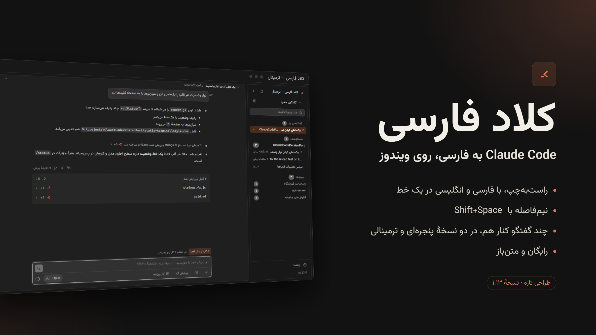
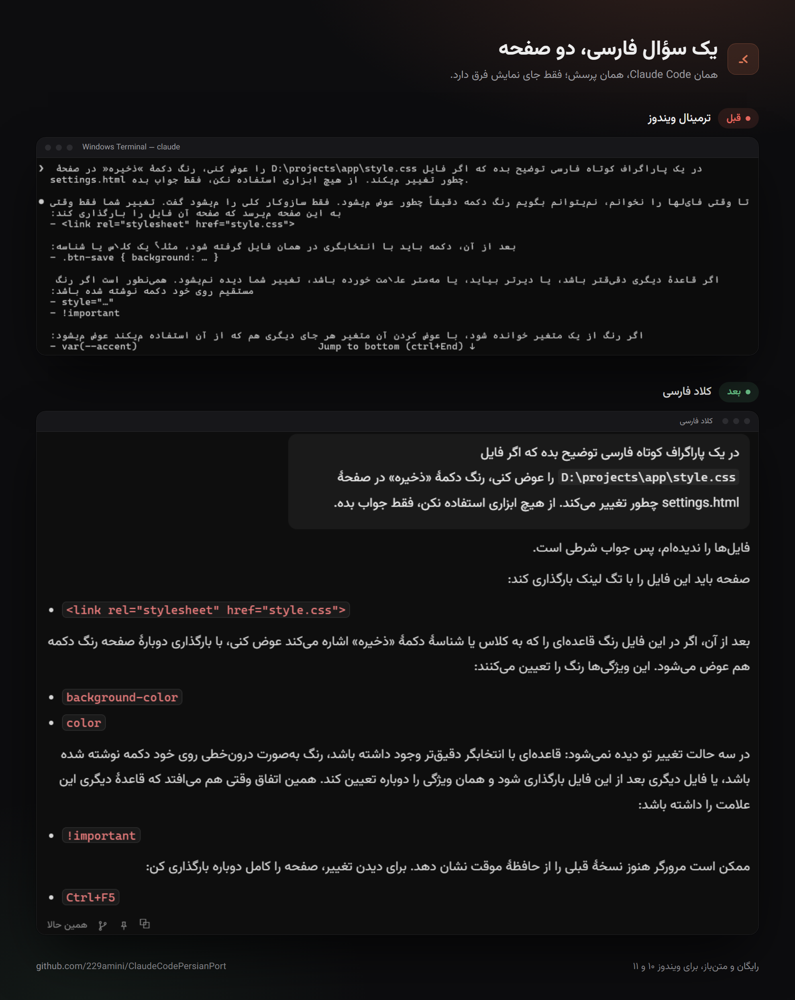
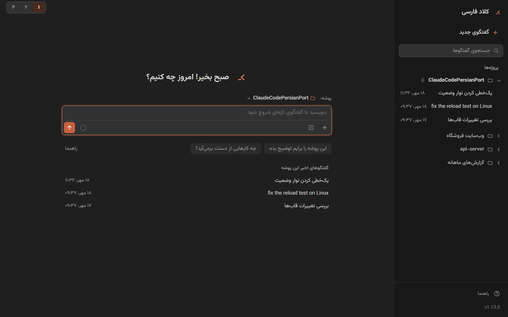
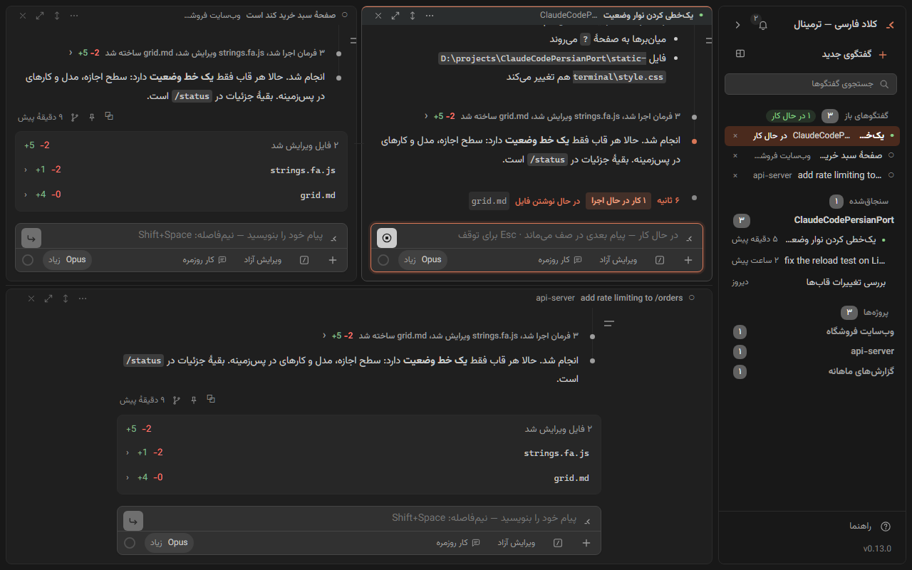
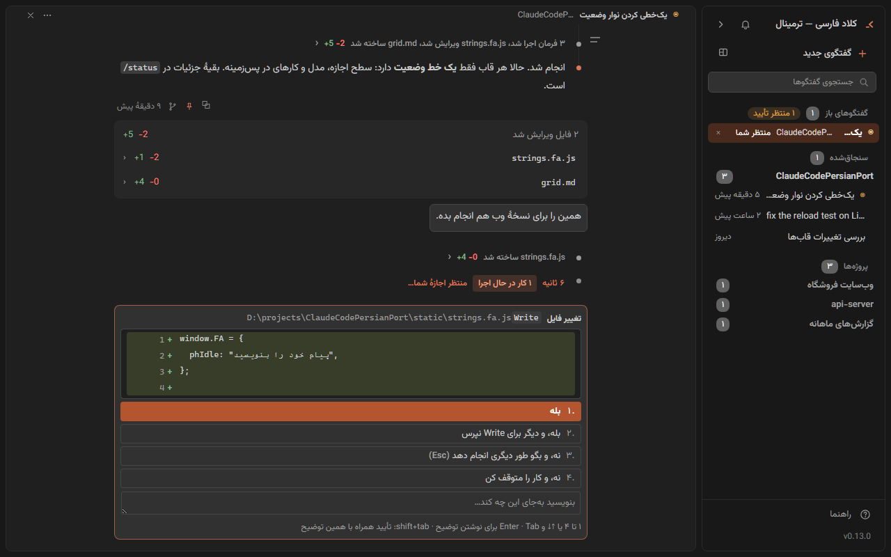

<div align="center">


# کلاد فارسی

### Claude Code به فارسی، روی ویندوز

پنجره‌ای فارسی و راست‌به‌چپ برای **Claude Code**. حروف به هم می‌چسبند، خطی که فارسی و
انگلیسی دارد به ترتیب درست خوانده می‌شود، و نیم‌فاصله تایپ می‌شود.

[](https://github.com/229amini/ClaudeCodePersianPort/releases/latest)
[](#نصب-در-سه-قدم)
[](LICENSE)
[](https://github.com/229amini/ClaudeCodePersianPort/issues/new/choose)

**[⬇ دانلود آخرین نسخه](https://github.com/229amini/ClaudeCodePersianPort/releases/latest)** ·
**[نصب در سه قدم](#نصب-در-سه-قدم)** ·
**[نظر و گزارش مشکل](https://github.com/229amini/ClaudeCodePersianPort/issues/new/choose)** ·
[English](#english)



</div>

<div dir="rtl">

## مشکل

در ترمینال ویندوز، فارسیِ Claude Code این شکلی است: حروف از هم جدا می‌شوند، جمله از آخر به
اول خوانده می‌شود، مسیر فایل وسط جمله تکه‌تکه می‌شود و نیم‌فاصله تایپ نمی‌شود.

<p align="center"></p>

علتش خود ترمینال است. ترمینال ویندوز ترتیب‌بندی دوجهته (BiDi) ندارد و Claude Code جای هر
حرف را خودش حساب می‌کند. هیچ تنظیمی در ترمینال این را درست نمی‌کند.

کلاد فارسی همان Claude Code رسمی را اجرا می‌کند و خروجی‌اش را در پنجره‌ای از Edge نشان
می‌دهد که فارسی را درست می‌چیند. حساب، تنظیمات، مهارت‌ها و هوک‌ها همان‌هایی است که الان
دارید. در خود Claude Code چیزی عوض نشده است.

## امکانات

- **رابط فارسی و راست‌به‌چپ:** دکمه‌ها، منوها، پرسش اجازه، پیام‌های خطا و راهنمای داخل
  برنامه.
- **خط آمیخته سر جایش می‌ماند:** اسم فایل، دستور، کد، آدرس و شمارهٔ نسخه وسط جملهٔ فارسی
  جابه‌جا نمی‌شوند.
- **نیم‌فاصله با <kbd>Shift</kbd>+<kbd>Space</kbd>.** همان نویسه به کلاد می‌رسد و در پاسخ
  برمی‌گردد.
- **اجازه به فارسی:** کلاد پیش از تغییر فایل یا اجرای دستور می‌پرسد و تغییر را خط به خط
  نشان می‌دهد. چهار سطح اجازه دارد: «طرح‌ریزی»، «محتاط»، «ویرایش آزاد» و «تأیید همه».
- **چند گفتگو کنار هم** در یک پنجره، هر کدام با وضعیت خودش.
- **جستجو و تغییر نام گفتگوها**، سنجاق کردن پیام‌ها، و شروع گفتگوی تازه از هر پیام.
  گفتگوی اصلی دست نمی‌خورد.
- **نمای متمرکز** (<kbd>Ctrl</kbd>+<kbd>Alt</kbd>+<kbd>F</kbd>): پرسش‌ها و پاسخ‌ها
  می‌مانند و مراحل هر کار پشت یک سطر جمع می‌شوند.
- **ظاهری از روی افزونهٔ Claude Code برای VS Code:** همان اندازه‌ها و فاصله‌ها، با رنگ
  نارنجی کلاد. زیر کادر پیام، «+» فایل پیوست می‌کند، «/» فهرست فرمان‌ها را باز می‌کند، و
  منوی مدل و منوی حالت سطح تلاش و لحن پاسخ را هم دارند.
- **سقف پنج‌ساعتهٔ مصرف:** اگر وسط کار به سقف برسید، پنجره بعد از باز شدنش کار را خودش
  ادامه می‌دهد.
- **نصب با دوبار کلیک.** اگر پایتون یا Claude Code نصب نباشد، نصب‌کننده نصبشان می‌کند و هر
  جا کاری از شما لازم باشد، به فارسی می‌گوید.
- **روی کامپیوتر خودتان.** برنامه فقط به `127.0.0.1` گوش می‌دهد و چیزی به جایی نمی‌فرستد.
  تنها ترافیک بیرونی مال خود Claude Code است.

## دو نسخه با یک موتور

| | |
|---|---|
|  |  |
| **«کلاد فارسی»:** پنجرهٔ گفتگو با دکمه و منو، برای کسی که نمی‌خواهد دستوری حفظ کند. | **«کلاد فارسی — ترمینال»:** شبیه ترمینال `claude`، با دستورهای `/`، کلیدهای میان‌بر و تا شش گفتگو کنار هم. |

نصب‌کننده برای هر دو نسخه یک میان‌بر روی دسکتاپ می‌گذارد.

<div align="center">

<br><sub>پیش از هر تغییر می‌بینید کلاد چه می‌خواهد بکند و با زدن یک عدد جواب می‌دهید.</sub>
</div>

## نصب در سه قدم

۱. **[آخرین نسخه را دانلود کنید](https://github.com/229amini/ClaudeCodePersianPort/releases/latest)**
   (فایل `Source code (zip)`، یا دکمهٔ سبز **Code** بالای همین صفحه و بعد **Download ZIP**)
   و از حالت فشرده خارج کنید.
۲. روی **`persian-claude-gui\setup.bat`** دوبار کلیک کنید.
۳. میان‌بر «کلاد فارسی» یا «کلاد فارسی — ترمینال» را از دسکتاپ باز کنید.

**پیش‌نیاز:** ویندوز ۱۰ یا ۱۱، مرورگر Edge (که روی ویندوز هست)، و یک **حساب Claude** که
Claude Code با آن کار کند (اشتراک Pro یا Max، یا حساب Console). اگر هنوز وارد حساب نشده‌اید،
نصب‌کننده قدم‌به‌قدم به فارسی راهنمایی‌تان می‌کند. پایتون و Claude Code را اگر نباشند، خودش
نصب می‌کند.

## پرسش‌های رایج

**هزینه دارد؟** برنامه رایگان و متن‌باز است (MIT). کار کلاد از اشتراک یا حساب Claude خودتان
کم می‌شود، به همان اندازه‌ای که در ترمینال کم می‌شد.

**امن است؟** برنامه فقط روی `127.0.0.1` کار می‌کند و برای هر اجرا کلید تصادفی تازه‌ای
می‌سازد. در سطح پیش‌فرض («محتاط») پیش از تغییر هر فایل یا اجرای هر دستور اجازه می‌گیرد.
کد کامل در همین مخزن است.

**با Claude Code چه فرقی دارد؟** زیر این برنامه همان Claude Code رسمی اجرا می‌شود و این
برنامه فقط نمایش فارسی آن است. گفتگویی که اینجا شروع کنید، در ترمینال با `claude --resume`
هم باز می‌شود.

**مک یا لینوکس؟** فعلاً فقط ویندوز. اگر لازمش دارید،
[در یک گزارش بنویسید](https://github.com/229amini/ClaudeCodePersianPort/issues/new/choose).

## بازخورد

اگر حرفی به‌هم ریخت، دکمه‌ای پیدا نشد یا امکانی کم بود، بگویید:

- **[گزارش مشکل یا پیشنهاد](https://github.com/229amini/ClaudeCodePersianPort/issues/new/choose).**
  فرم‌ها فارسی‌اند و یک عکس از صفحه بیشترین کمک را می‌کند.
- اگر به کارتان آمد، **یک ⭐ بدهید** و پروژه را برای کسی بفرستید که با Claude Code کار
  می‌کند.

> این پروژه مستقل است و به Anthropic وابسته نیست. «Claude» و «Claude Code» نشان‌های تجاری
> Anthropic هستند و این برنامه فقط CLI رسمی را اجرا می‌کند.

</div>

---

<a id="english"></a>

## English

**Claude Persian** (کلاد فارسی) is a right-to-left Persian front-end for the
[Claude Code](https://claude.com/claude-code) CLI on Windows. It runs the official, unmodified
`claude` binary and shows its output in a Microsoft Edge app window with no browser UI, which
lays Persian out correctly. It was built for a non-technical colleague who uses Claude Code
every day without opening a terminal, and has been in that use since August 2026.

> Independent project. Not affiliated with, endorsed by, or supported by Anthropic.
> "Claude" and "Claude Code" are trademarks of Anthropic.

### Why a window and not a terminal

A terminal is a fixed grid of cells. Persian is cursive: each letter's shape depends on its
neighbours, the script runs right to left, and a line that mixes Persian with a file path or a
code span needs the Unicode Bidirectional Algorithm to come out in reading order. Windows
Terminal shapes some glyphs but does not reorder bidirectional text, conhost does neither, and
neither offers a way to type a zero-width non-joiner (ZWNJ, the Persian half-space).

Claude Code's TUI is built on Ink, which computes the cursor position and cell widths itself. A
BiDi-aware terminal such as mlterm fixes the letter shapes and still leaves the line order
broken. The constraint is the cell grid, so the program inside it cannot fix this.

A browser engine is the one text renderer that ships with Windows and handles all of it. This
project keeps the CLI and replaces only the screen.

### Features

- **Persian interface** in both editions: menus, buttons, the permission dialog, error messages
  and the built-in guide (`static/help.html`).
- **Mixed lines in order.** Paths, commands, inline code, URLs and version numbers are isolated
  so they keep their place inside Persian sentences. Windows paths always lay out left to
  right.
- **ZWNJ on <kbd>Shift</kbd>+<kbd>Space</kbd>**, preserved on the way to the CLI and back.
- **Permission prompts in Persian**, with the real diff for Edit, Write and MultiEdit. Four
  approval postures: plan, ask (default), accept edits and approve all.
- **Several conversations at once**: 1, 2 or 4 panes in the web edition, 1 to 6 with draggable
  dividers in the terminal edition.
- **Sessions**: a sidebar of projects and their conversations, search across all of them,
  rename, pinned messages, resume after a crash, and a new conversation forked from any message
  (the source conversation is left as it was).
- **Focus view** (<kbd>Ctrl</kbd>+<kbd>Alt</kbd>+<kbd>F</kbd> or `/focus`): each turn's tool
  steps collapse behind one row, so only questions and answers stay open.
- **Look and composer bar after the Claude Code VS Code extension** (1.13 / 0.13): its sizes
  and spacing in Claude orange; attach, `@` mentions and MCP toggles behind «+», a command
  palette behind «/», model and mode menus carrying the effort level and the response style,
  a context and plan-usage ring, and a prompt-cache clock.
- **The five-hour usage limit**: a turn cut off by it continues by itself once the limit
  resets, the way the TUI does.
- **CLI features beyond chat**: `AskUserQuestion` as a real form, plan mode with the plan
  rendered as markdown, a message queue you can cancel from or send now, `!` shell mode, `@`
  file mentions, input history with ↑ and <kbd>Ctrl</kbd>+<kbd>R</kbd>, `/export` and
  `/branch`.
- **One double-click install**: `setup.bat` installs Python and Claude Code when they are
  missing, writes a desktop shortcut for each edition, and walks a user who has not logged in
  through `claude` login in Persian.

### Two editions, one engine

| | Claude Persian (web) | Claude Persian, terminal edition |
|---|---|---|
| Folder | `persian-claude-gui/static/` | `persian-claude-gui/static-terminal/` |
| Version | 1.x (tags `v1.*`) | 0.x (tags `terminal-v0.*`) |
| Shape | chat window with buttons and menus | one column drawn after the Ink TUI: `/` commands, the TUI's key chords, its wording in Persian |
| Panes | 1, 2 or 4 | 1 to 6, draggable dividers |
| Sidebar | projects, then their conversations | same, collapsible to a 48 px rail |

Both are served by the same `server.py` and chosen with `--ui web` or `--ui terminal`.

### Install

1. Download the [latest release](https://github.com/229amini/ClaudeCodePersianPort/releases/latest)
   (`Source code (zip)`) and unzip it.
2. Double-click `persian-claude-gui\setup.bat`.
3. Open either desktop shortcut.

Requirements: Windows 10 or 11, Microsoft Edge, and a Claude account that can run Claude Code
(Pro, Max or Console). Setup installs Python 3.12 and Claude Code if they are missing, logs
every step to `persian-claude-gui\setup-log.txt`, and is safe to run again: each step checks
before it acts. An offline mode (`setup.ps1 -Payload <dir>`) exists but has not yet been run on
a real machine.

### How it works

Three processes in one chain. No framework, no build step, no npm, no CDN:

```
Edge --app=http://127.0.0.1:PORT/?t=TOKEN    window with no browser UI, static/ UI
   ↓ POST /api/*        ↑ SSE GET /api/events
server.py (Python 3.12, stdlib only)         subprocess manager, NDJSON parser,
   ↓ stdin stream-json  ↑ stdout stream-json  transcript reader, permission broker
claude -p                                     the real CLI: same ~/.claude,
                                              skills, hooks, subscription auth
```

- **One long-lived `claude -p` per open conversation**, talking stream-json with
  `--include-partial-messages`, so tokens stream. A new turn is one NDJSON `user` message on
  stdin; the process is never respawned for a turn.
- **Recovery** uses the `session_id` from `system/init`: after a crash or a kill,
  `--resume <id>` reattaches the same conversation.
- **Permissions** arrive in-band. The CLI is spawned with `--permission-prompt-tool stdio`, so
  each approval is a `can_use_tool` control request on stdout and the answer goes back on
  stdin. Nothing is hooked or patched.
- **The pickers mirror the CLI.** Models, effort levels, output styles, slash commands and
  agents come from what `initialize` reports, and every change goes through the CLI's control
  protocol.
- **SSE for events, POST for actions**, because the Python standard library has no WebSocket
  server. Each event carries an id, so a reconnect after sleep resumes where it stopped instead
  of replaying the whole conversation.
- **History** is replayed from the CLI's own transcripts in `~/.claude/projects/`, through the
  same renderer as live events. A conversation started here opens with `claude --resume`, and
  the other way round.
- **Unknown stream events** render as a collapsed raw-JSON card. The stream format changes
  between CLI versions, and a new event type must not break the page.

### Rendering rules

Bidirectional text is the most frequent source of defects here. The shell is `<html dir="rtl" lang="fa">` and every block that holds content sets its own
direction. A block's direction is decided by counting its strong letters, not by its first
character, so a Persian paragraph that opens with an English word stays right to left. Inline
code and paths are isolated left to right, and <kbd>Shift</kbd>+<kbd>Space</kbd> inserts
U+200C.

### Security

- Binds `127.0.0.1` only, on a random free port.
- A `secrets.token_urlsafe(32)` token is passed once in the window URL, then held as a
  host-only `HttpOnly; SameSite=Strict` cookie. Every request is checked with
  `secrets.compare_digest`.
- The server lives as long as the window: about 10 seconds after the last event stream closes,
  it stops the `claude` subprocess and exits.
- Nothing is uploaded anywhere. All traffic that leaves the machine is the CLI's own.

### Development

```powershell
# with a console (resolve <python> on your machine; do not rely on the Store alias)
<python> persian-claude-gui\server.py --cwd <project> --no-window

# with the Edge window; --ui terminal for the terminal edition (default: web)
<python> persian-claude-gui\server.py --cwd <project> --ui terminal

# full bootstrap into a throwaway location (leaves a real install alone)
.\persian-claude-gui\setup.ps1 -DeployRoot C:\tmp\pcg -ProjectDir C:\tmp\proj `
                              -ShortcutDir C:\tmp\lnk -SkipSmokeTest
```

Set `PYTHONIOENCODING=utf-8` before driving the server from PowerShell. The front-end is plain
ES modules: edit a file under `static/` or `static-terminal/` and reload the window.

```
persian-claude-gui/
  server.py              the engine: HTTP, SSE, CLI processes, permission broker
  static/                web edition (index.html, js/, style.css, strings.fa.js, help.html)
  static-terminal/       terminal edition, same layout
  setup.bat, setup.ps1   Windows bootstrap
  run_spec_test.py, test_*.py, smoke_test.py   checks
```

All user-visible text lives in `strings.fa.js`, one per edition.

### Checks

About twenty headless checks load each edition's shipping `index.html` in a Chromium browser
(`PCG_UI=web` or `terminal`): the rendering spec (`run_spec_test.py`), narrow windows
(`test_layout.py`), split panes, reload, the composer bar, message marks, VS Code extension
parity (`test_parity.py`), keys, strings and more, plus `test_units.py` for the server. They
cost nothing and need no login. On Windows they use Edge; elsewhere, point `PCG_BROWSER` at a
Chromium binary. One check, `smoke_test.py`, drives a real CLI turn and **uses one turn of your
subscription**.

### Contributing and feedback

Bug reports and ideas are welcome in English or Persian:
[open an issue](https://github.com/229amini/ClaudeCodePersianPort/issues/new/choose). If you
work in another right-to-left language (Arabic, Hebrew, Urdu), reports on how the same problems
show up for you are especially useful. For code, see [CONTRIBUTING.md](CONTRIBUTING.md).

## License

MIT, see [LICENSE](LICENSE). Vazirmatn (SIL OFL) and marked (MIT) are vendored on purpose,
because the target PC may be offline or locked down.
