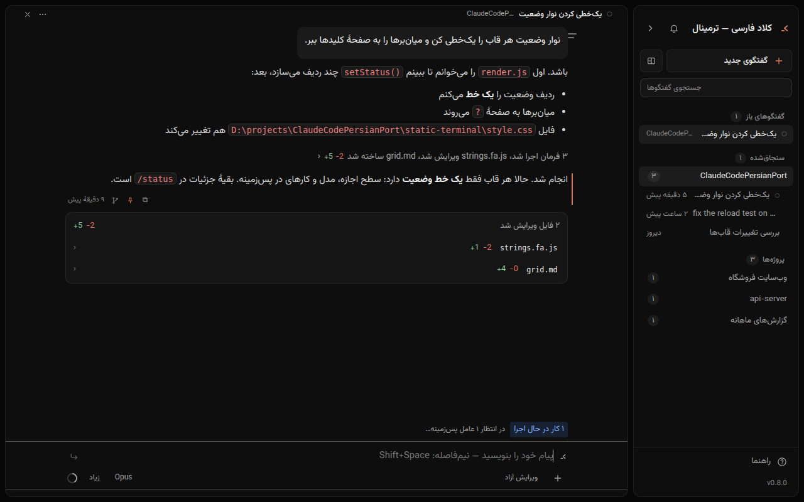

<div align="center">


# کلاد فارسی

### Claude Code، بالاخره به فارسیِ درست

پنجره‌ای کاملاً راست‌به‌چپ و فارسی برای **Claude Code** روی ویندوز —
بی‌ترمینال، بی‌حروفِ به‌هم‌ریخته، با نیم‌فاصله.

[](https://github.com/229amini/ClaudeCodePersianPort/releases/latest)
[](#نصب-در-سه-قدم)
[](LICENSE)
[](https://github.com/229amini/ClaudeCodePersianPort/issues/new/choose)

**[⬇ دانلود آخرین نسخه](https://github.com/229amini/ClaudeCodePersianPort/releases/latest)** ·
**[نصب در سه قدم](#نصب-در-سه-قدم)** ·
**[نظر و گزارش مشکل](https://github.com/229amini/ClaudeCodePersianPort/issues/new/choose)** ·
[English](#english)



</div>

<div dir="rtl">

## چرا؟

اگر تا حالا در ترمینال ویندوز با Claude Code فارسی نوشته باشید، این‌ها را دیده‌اید:
حروف جدا از هم، جمله‌ای که از آخر به اول خوانده می‌شود، مسیر فایلی که وسط جملهٔ فارسی
تکه‌تکه می‌شود، و نیم‌فاصله‌ای که اصلاً تایپ نمی‌شود.

مشکل از شما نیست و از کلاد هم نیست — **ترمینال ویندوز برای فارسی ساخته نشده.**
کلاد فارسی همان Claude Code اصلی را اجرا می‌کند، فقط آن را در پنجره‌ای نشان می‌دهد که
فارسی را درست می‌چیند. همان حساب، همان تنظیمات، همان مهارت‌ها و هوک‌ها؛ هیچ چیزی
بازنویسی نشده.

## چه چیزی می‌گیرید

- **همه‌چیز فارسی و راست‌به‌چپ** — نه فقط پیام‌ها: دکمه‌ها، منوها، پرسش اجازه، خطاها و
  راهنمای کامل داخل برنامه.
- **خطِ آمیختهٔ فارسی و انگلیسی درست می‌نشیند** — اسم فایل، دستور، کد، آدرس و شمارهٔ نسخه
  وسط جملهٔ فارسی جابه‌جا نمی‌شوند.
- **نیم‌فاصله با <kbd>Shift</kbd>+<kbd>Space</kbd>** که سالم به کلاد می‌رسد و سالم برمی‌گردد.
- **کلاد پیش از هر تغییری به فارسی اجازه می‌گیرد**، با نمایش دقیق تغییر — و چهار سطح اجازه،
  از «فقط طرح بریز» تا «تأیید همه».
- **چند گفتگو کنار هم** در یک پنجره، هر کدام با وضعیت خودش.
- **جستجو و تغییر نام گفتگوها**، سنجاق کردن پیام‌ها، و **گفتگوی تازه از هر پیام** بدون
  از دست دادن گفتگوی قبلی.
- **نمای متمرکز** (<kbd>Ctrl</kbd>+<kbd>Alt</kbd>+<kbd>F</kbd>): فقط پرسش‌ها و پاسخ‌ها، مراحل
  کار پشت یک سطر.
- **انتخاب مدل، میزان تفکر و نمایش مصرف** با یک کلیک، همان‌طور که در claude.ai/code دارید.
- **نصب با یک دوبار-کلیک** — اگر پایتون یا Claude Code نصب نباشد، نصب‌کننده خودش نصبشان
  می‌کند و هر جا لازم باشد به فارسی می‌گوید چه کنید.
- **همه‌چیز روی کامپیوتر خودتان** — برنامه فقط روی همین سیستم اجرا می‌شود و چیزی جایی
  نمی‌فرستد؛ تنها ارتباطِ بیرونی، ارتباط خودِ Claude Code است.

## دو نسخه، یک موتور

| | |
|---|---|
|  |  |
| **«کلاد فارسی»** — پنجرهٔ گفتگو با دکمه و منو. برای کسی که نمی‌خواهد چیزی حفظ کند. | **«کلاد فارسی — ترمینال»** — حس ترمینال `claude`، فقط فارسی و خوانا: دستورهای `/`، کلیدهای میان‌بر، و چند گفتگو کنار هم. |

نصب، هر دو میان‌بر را روی دسکتاپ می‌سازد؛ با هر کدام راحت‌ترید کار کنید.

<div align="center">

<br><sub>پیش از هر تغییر، دقیقاً می‌بینید کلاد چه می‌خواهد بکند — و با یک عدد جواب می‌دهید.</sub>
</div>

## نصب در سه قدم

۱. **[آخرین نسخه را دانلود کنید](https://github.com/229amini/ClaudeCodePersianPort/releases/latest)**
   (فایل `Source code (zip)`) — یا از دکمهٔ سبز **Code** بالای همین صفحه، **Download ZIP** — و
   از حالت فشرده خارج کنید.
۲. روی **`persian-claude-gui\setup.bat`** دوبار کلیک کنید.
۳. از میان‌برِ «کلاد فارسی» یا «کلاد فارسی — ترمینال» روی دسکتاپ بازش کنید.

**پیش‌نیاز:** ویندوز ۱۰ یا ۱۱، مرورگر Edge (روی ویندوز هست)، و یک **حساب Claude** که
Claude Code با آن کار کند (اشتراک Pro/Max یا حساب Console). اگر هنوز وارد حساب نشده‌اید،
نصب‌کننده همان‌جا به فارسی می‌گوید چه کنید. پایتون و Claude Code را اگر نباشند، خود
نصب‌کننده نصب می‌کند.

## پرسش‌های رایج

**هزینه دارد؟** خودِ برنامه رایگان و متن‌باز است (MIT). کارهایی که کلاد انجام می‌دهد از
اشتراک یا حساب Claude خودتان حساب می‌شود، دقیقاً مثل وقتی که Claude Code را در ترمینال
اجرا می‌کنید.

**امن است؟** برنامه فقط روی `127.0.0.1` کار می‌کند، با کلیدی تصادفی برای هر بار اجرا، و
در حالت پیش‌فرض («محتاط») پیش از هر تغییر فایل یا اجرای دستور از شما اجازه می‌گیرد. کدش
کامل همین‌جاست؛ بخوانیدش.

**با Claude Code فرق دارد؟** نه — زیرش همان Claude Code رسمی اجرا می‌شود. این فقط نمایشِ
فارسی آن است. گفتگوهایی که اینجا شروع کنید با `claude --resume` در ترمینال هم باز می‌شوند.

**مک یا لینوکس؟** فعلاً فقط ویندوز. اگر لازمش دارید، [بگویید](https://github.com/229amini/ClaudeCodePersianPort/issues/new/choose).

## نظر شما مهم‌ترین بخش است

این پروژه با بازخورد کاربران فارسی‌زبان جلو می‌رود. هر چیزی دیدید — حرفی که به‌هم ریخته،
دکمه‌ای که گم بود، امکانی که کم دارید — بگویید:

- **[گزارش مشکل یا پیشنهاد](https://github.com/229amini/ClaudeCodePersianPort/issues/new/choose)** — فرم‌ها فارسی‌اند؛ یک
  عکس از صفحه بیشترین کمک را می‌کند.
- اگر به کارتان آمد، **یک ⭐ بدهید** و برای دوستی که با Claude Code کار می‌کند بفرستید —
  همین است که پروژه را به دست بقیه می‌رساند.

> این پروژه مستقل است و وابسته به Anthropic نیست. «Claude» و «Claude Code» نشان‌های
> تجاری Anthropic هستند؛ این برنامه فقط CLI رسمی را اجرا می‌کند.

</div>

---

<a id="english"></a>

## English

**Claude Persian** is a fully right-to-left Persian front-end for the
[Claude Code](https://claude.com/claude-code) CLI on Windows. Windows terminals have no BiDi
reordering, so mixed Persian/English lines come out scrambled and there is no ZWNJ input; a
browser engine is the only Windows text renderer that shapes Persian correctly. This app is a
chrome-less Edge window over the **real, unmodified CLI** — same account, same `~/.claude`,
same skills and hooks.

It ships in two editions on one engine: **«کلاد فارسی»** (a chat window with buttons and menus)
and **«کلاد فارسی — ترمینال»** (the CLI's own feel — `/` commands, key chords, several
conversations side by side).

> Independent project, not affiliated with, endorsed by, or supported by Anthropic.
> "Claude" and "Claude Code" are trademarks of Anthropic.

### Architecture

Three processes, one chain — no framework, no build step, no npm, no CDN:

```
Edge --app=http://127.0.0.1:PORT/?t=TOKEN    chrome-less window, static/ UI
   ↓ POST /api/*        ↑ SSE GET /api/events
server.py (Python 3.12, stdlib only)         subprocess mgr, NDJSON parser,
   ↓ stdin stream-json  ↑ stdout stream-json  transcript reader, permission broker
claude -p                                     the real CLI: same ~/.claude,
                                              skills, hooks, subscription auth
```

One long-lived `claude` process per open conversation; a new turn is one NDJSON `user`
message on stdin, never a respawn. `session_id` from `system/init` is the recovery path
(`--resume <id>` after any crash). Approvals arrive in-band as `can_use_tool` control requests
(`--permission-prompt-tool stdio`).

### Requirements

Windows 10/11 · Microsoft Edge · a Claude account that can run Claude Code · Python 3.12+
(`setup.ps1` installs Python and the CLI when they are missing).

### Run it

```powershell
# dev, with a console (resolve <python> on your machine; never rely on the Store alias)
<python> persian-claude-gui\server.py --cwd <project> --no-window

# with the Edge window; --ui terminal for the terminal edition (default: web)
<python> persian-claude-gui\server.py --cwd <project> --ui terminal

# full bootstrap into a throwaway location (does not touch a real install)
.\persian-claude-gui\setup.ps1 -DeployRoot C:\tmp\pcg -ProjectDir C:\tmp\proj `
                              -ShortcutDir C:\tmp\lnk -SkipSmokeTest
```

Set `PYTHONIOENCODING=utf-8` before driving the server from PowerShell.

### Checks

About twenty free headless gates drive the shipping `index.html` of each edition (`PCG_UI=web`
or `terminal`): the rendering spec (`run_spec_test.py`), narrow windows (`test_layout.py`),
split panes, reload, the composer bar, message marks, VS Code-extension parity
(`test_parity.py`), keys, strings and more, plus `test_units.py` for the server. One check,
`smoke_test.py`, drives a real CLI turn and **spends a turn of your subscription**. The full
table is in [`CLAUDE.md`](CLAUDE.md); `claude-persian-rtl-spec.md` is binding for anything that
renders text.

### Security model

- Binds `127.0.0.1` only, on a random free port.
- A `secrets.token_urlsafe(32)` token is passed once in the window URL, then held as a
  host-only `HttpOnly; SameSite=Strict` cookie; every request is compared with
  `secrets.compare_digest`.
- The server's lifetime is tied to the window: last SSE client gone for ~10 s → the `claude`
  subprocess is killed and the process exits.
- Nothing is uploaded anywhere. All traffic that leaves the machine is the CLI's own.

### Contributing and feedback

Bug reports and ideas are welcome in either language —
[open an issue](https://github.com/229amini/ClaudeCodePersianPort/issues/new/choose). Code:
see [CONTRIBUTING.md](CONTRIBUTING.md); `wiki/` holds the measured CLI contract and the RTL
traps, several of which fail with no error message at all.

## License

MIT — see [LICENSE](LICENSE). Vazirmatn (SIL OFL) and marked (MIT) are vendored on purpose:
the target PC may be offline or locked down.
